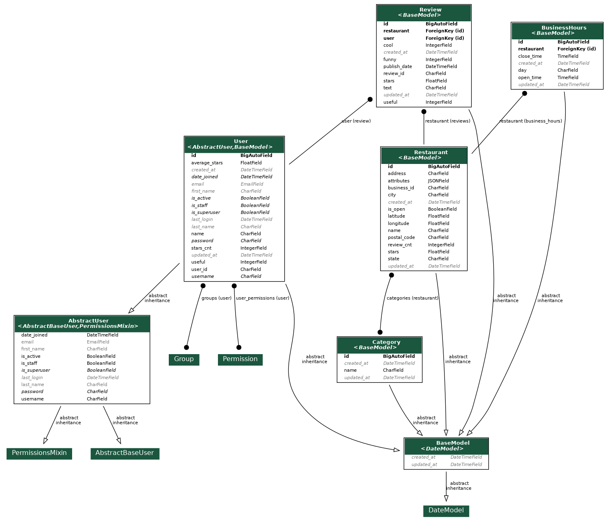

# Restaurant Project
This is a simple restaurant manager project.

## Development
- Install docker and docker-compose.
- Run `cp .env.sample .env` and fill `.env` file.
- Run `docker-compose -f docker-compose.dev.yml up --build`. It may take some time (because seeding initial data).
- The service is run under `0.0.0.0:8000` and update after each file changes.

## Deployment
- Install docker and docker-compose.
- Run `cp .env.sample .env` and fill `.env` file.
- Run `docker-compose -f docker-compose.prod.yml up --build`. It may take some time (because seeding initial data).
- The service is run under `yourserverip` or `domain`.

## Documents
### Rest API Documents
- You can see api documentations under `/swagger` or `/redoc` urls.
- Also, the pdf file `rest_apis_doc.pdf` is in the root of project.

### Database Diagram

### More Details
####Database Models
As you see in the above picture, We have three primary models for our database: _User_, _Restaurant_ and _Review_. 
Also, I developed two other models for better design: _Category_ and _BusinessHour_.
The main idea of the model's fields came from seed data, but I added some additional fields. 
For example, we needed the number of reviews each user has to update the average_stars value quickly.

####SQL vs. NoSQL
I chose Postgres as a relational database because there is a connection between different entities we have. 
Also, the number of data isn't too much for a relational database. But maybe after scaling up the service, 
it's better to think about NoSQL databases.

#### APIs
We have twelve APIs in this project (You can see the details in _swagger_) 

Two of them are for login and logout users:
- I assumed the user list was fixed and used a _TokenAuthentication_ method.
- The _username_ for all users sat as their _user_id_, and the _password_ is _initial_password_.

Three of them need the user to be logged in:
- Get user reviews.
- Create a new review.
- Delete a review.

Other APIs are:
- Get the restaurants list.
- Search restaurants by category (adding query param _?category=food_).
- Get all reviews of one specific restaurant.
- Get details of one specific restaurant.
- Get all reviews.
- Search reviews by keyword (adding query param _?keyword=good_).
- Get details of one specific review.

The API flow is:
- API <-> View <-> Serializer <-> Model <-> Database

#### Test
- We have **90% test coverage** at the project. 

### Future Works
- Add Statsd or Prometheus for monitoring APIs.
- Connect project logger to Sentry for seeing logs on the sentry dashboard.
- Switch to any CI/CD to have better deploying process (for example, Gitlab CI/CD).
- Deploy on a cloud platform and switch to Kubernetes for better scaling and maintaining features.
- Think of NoSQL for scaling up the database.

